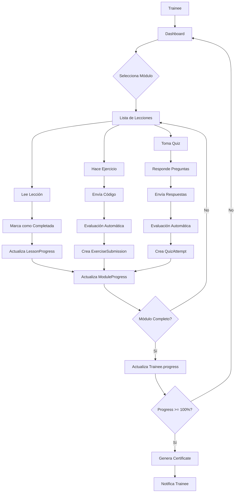

# Estructura del Proyecto - Laravel Bootcamp PRO

## 📁 Estructura General

```
trainee/
├── 📱 Backend Laravel
│   ├── app/
│   │   ├── Http/
│   │   │   └── Controllers/
│   │   │       ├── Api/
│   │   │       │   ├── ModuleController.php       # Gestión de módulos
│   │   │       │   ├── LessonController.php       # Gestión de lecciones
│   │   │       │   ├── ExerciseController.php     # Evaluación de ejercicios
│   │   │       │   └── QuizController.php         # Sistema de quizzes
│   │   │       ├── TraineeController.php          # Base (existente)
│   │   │       └── CertificateController.php      # Base (existente)
│   │   └── Models/
│   │       ├── 🎓 Bootcamp Models
│   │       │   ├── Module.php                     # Módulo del curso
│   │       │   ├── Lesson.php                     # Lección con contenido
│   │       │   ├── Exercise.php                   # Ejercicio práctico
│   │       │   ├── Quiz.php                       # Quiz de evaluación
│   │       │   ├── QuizQuestion.php               # Pregunta de quiz
│   │       │   ├── LessonProgress.php             # Progreso por lección
│   │       │   ├── ModuleProgress.php             # Progreso por módulo
│   │       │   ├── ExerciseSubmission.php         # Código enviado
│   │       │   └── QuizAttempt.php                # Intento de quiz
│   │       ├── 👤 User Models
│   │       │   ├── Trainee.php                    # Usuario del bootcamp (mejorado)
│   │       │   └── Certificate.php                # Certificado (mejorado)
│   │       └── 🏢 ERP Models (para proyecto final)
│   │           ├── User.php
│   │           ├── Client.php
│   │           ├── Employee.php
│   │           ├── Project.php
│   │           ├── Task.php
│   │           ├── Service.php
│   │           ├── Invoice.php
│   │           └── Payment.php
│   ├── database/
│   │   ├── migrations/
│   │   │   ├── 2025_11_13_110000_create_bootcamp_structure.php    # 9 tablas
│   │   │   └── 2025_11_13_120000_create_erp_structure.php         # 10 tablas
│   │   └── seeders/
│   │       └── LaravelBootcampSeeder.php          # Contenido completo (7 módulos)
│   ├── routes/
│   │   ├── api.php                                # 22 endpoints bootcamp
│   │   └── web.php                                # Rutas base
│   ├── config/
│   ├── docker/
│   ├── docker-compose.yml
│   └── .env.example
│
├── 🌐 Frontend Next.js
│   ├── app/
│   │   ├── page.tsx                               # Landing page ✨
│   │   ├── dashboard/
│   │   │   └── page.tsx                           # Dashboard principal ✨
│   │   ├── modules/
│   │   │   └── [id]/
│   │   │       └── page.tsx                       # Vista de módulo (base)
│   │   ├── lessons/
│   │   │   └── [id]/
│   │   │       └── page.tsx                       # Vista de lección (base)
│   │   ├── layout.tsx                             # Layout principal
│   │   ├── providers.tsx                          # React Query provider
│   │   └── globals.css                            # Estilos Tailwind
│   ├── components/                                # Componentes reutilizables
│   │   ├── ModuleCard.tsx                         # (por crear)
│   │   ├── LessonContent.tsx                      # (por crear)
│   │   ├── ExerciseEditor.tsx                     # (por crear)
│   │   └── QuizComponent.tsx                      # (por crear)
│   ├── lib/
│   │   └── api.ts                                 # Cliente API + TypeScript
│   ├── package.json
│   ├── tsconfig.json
│   ├── tailwind.config.ts
│   ├── next.config.js
│   └── .env.example
│
└── 📚 Documentación
    ├── README.md                                  # Readme principal (actualizado)
    ├── BOOTCAMP_README.md                         # Documentación técnica completa
    ├── QUICKSTART.md                              # Guía de inicio rápido
    ├── BOOTCAMP_SUMMARY.md                        # Resumen ejecutivo
    ├── PROJECT_STRUCTURE.md                       # Este archivo
    ├── DEPLOYMENT.md                              # Deployment (existente)
    └── setup-bootcamp.sh                          # Script instalación automática
```

## 🗄️ Base de Datos - Relaciones

### Sistema de Bootcamp

```
Module (1) ──────< (N) Lesson (1) ──────< (N) Exercise
   │                      │
   │                      └──────< (N) LessonProgress ────> (1) Trainee
   │
   └──────< (N) Quiz (1) ──────< (N) QuizQuestion
              │
              └──────< (N) QuizAttempt ────> (1) Trainee

ModuleProgress ────> (1) Module
ModuleProgress ────> (1) Trainee

ExerciseSubmission ────> (1) Exercise
ExerciseSubmission ────> (1) Trainee

Certificate ────> (1) Trainee
```

### Sistema ERP (Proyecto Final)

```
User (role: manager/employee/client)
   │
   ├──> (1) Client
   ├──> (1) Employee
   │
   └──> (N) Project (1) ────< (N) Task
           │                      │
           │                      └──> (1) Employee (assigned_to)
           │
           └──> (N) Invoice (1) ────< (N) InvoiceItem ────> (1) Service
                   │
                   └──> (N) Payment
```

## 🎯 Flujo de Datos - Tracking de Progreso



## 📊 Ponderación de Progreso

### Nivel Módulo
```
ModuleProgress =
    (Lecciones Completadas / Total Lecciones) × 40% +
    (Ejercicios Correctos / Total Ejercicios) × 40% +
    (Quiz Aprobado ? 20% : 0%)
```

### Nivel General
```
TraineeProgress = Promedio(ModuleProgress de todos los módulos)

Si TraineeProgress >= 100%:
    → Generar Certificate automáticamente
```

## 🔌 API Endpoints - Resumen

### Módulos (3 endpoints)
- `GET /api/bootcamp/modules` - Listar
- `GET /api/bootcamp/modules/{id}` - Detalle
- `GET /api/bootcamp/modules/{id}/progress` - Progreso

### Lecciones (4 endpoints)
- `GET /api/bootcamp/lessons/{id}` - Detalle
- `POST /api/bootcamp/lessons/{id}/start` - Iniciar
- `POST /api/bootcamp/lessons/{id}/complete` - Completar
- `GET /api/bootcamp/lessons/{id}/progress` - Progreso

### Ejercicios (3 endpoints)
- `GET /api/bootcamp/exercises/{id}` - Detalle
- `POST /api/bootcamp/exercises/{id}/submit` - Enviar código
- `GET /api/bootcamp/exercises/{id}/submissions` - Historial

### Quizzes (4 endpoints)
- `GET /api/bootcamp/quizzes/{id}` - Detalle
- `POST /api/bootcamp/quizzes/{id}/start` - Iniciar
- `POST /api/bootcamp/quizzes/{id}/submit` - Enviar respuestas
- `GET /api/bootcamp/quizzes/{id}/attempts` - Historial

### Dashboard (1 endpoint)
- `GET /api/trainees/{id}/dashboard` - Estadísticas completas

**Total: 15 endpoints principales + 7 secundarios = 22 endpoints**

## 🎨 Stack Tecnológico

### Backend
- **Framework:** Laravel 11
- **PHP:** 8.2+
- **Base de Datos:** MySQL 8.0
- **Contenedores:** Docker + Docker Compose
- **ORM:** Eloquent
- **Testing:** PHPUnit

### Frontend
- **Framework:** Next.js 14 (App Router)
- **UI Library:** React 18
- **Language:** TypeScript
- **Styling:** Tailwind CSS
- **State:** React Query + Zustand
- **HTTP Client:** Axios

### DevOps
- **Containerization:** Docker
- **Web Server:** Nginx (en contenedor)
- **Mail Testing:** MailHog
- **Package Manager:** Composer (PHP) + npm (Node)

## 📦 Archivos Clave

### Configuración
- `docker-compose.yml` - Orquestación de contenedores
- `.env` - Variables de entorno Laravel
- `frontend/.env.local` - Variables de entorno Next.js
- `composer.json` - Dependencias PHP
- `frontend/package.json` - Dependencias Node

### Scripts
- `setup-bootcamp.sh` - Instalación automática completa
- `provision.sh` - Provisión base (existente)
- `deploy.sh` - Deploy a producción (existente)

### Seeders
- `LaravelBootcampSeeder.php` - 7 módulos completos con contenido

### Documentación
- `BOOTCAMP_README.md` - Técnica completa (400+ líneas)
- `QUICKSTART.md` - Inicio rápido (180+ líneas)
- `BOOTCAMP_SUMMARY.md` - Resumen ejecutivo
- `PROJECT_STRUCTURE.md` - Esta estructura

## 🔄 Flujo de Desarrollo

### Para Agregar Contenido

1. **Nuevo Módulo:**
   - Editar `LaravelBootcampSeeder.php`
   - Agregar Module::create() con lecciones
   - Ejecutar `php artisan db:seed --class=LaravelBootcampSeeder`

2. **Nueva Lección:**
   - Agregar Lesson::create() en seeder
   - Escribir contenido en Markdown
   - Agregar ejercicios relacionados

3. **Nuevo Ejercicio:**
   - Agregar Exercise::create() en seeder
   - Definir test_cases para evaluación
   - Configurar puntos y dificultad

4. **Nuevo Quiz:**
   - Agregar Quiz::create() en seeder
   - Agregar QuizQuestion::create() para cada pregunta
   - Configurar passing_score

### Para Extender Frontend

1. **Nuevo Componente:**
   - Crear en `frontend/components/`
   - Usar TypeScript
   - Aplicar Tailwind CSS

2. **Nueva Página:**
   - Crear en `frontend/app/[ruta]/page.tsx`
   - Usar React Query para datos
   - Implementar loading y error states

3. **Nuevo API Endpoint:**
   - Agregar método en `lib/api.ts`
   - Definir tipos TypeScript
   - Documentar en README

## 🎯 Próximos Pasos Sugeridos

### Prioridad Alta
1. Completar páginas de módulo individual
2. Implementar vista de lección con Markdown rendering
3. Crear editor de código para ejercicios
4. Implementar componente de quiz interactivo

### Prioridad Media
5. Sistema de notificaciones
6. Página de perfil de trainee
7. Historial de progreso con gráficos
8. Certificado descargable en PDF

### Prioridad Baja
9. Sistema de badges
10. Leaderboard
11. Foro de discusión
12. Sistema de mentores

---

**Estructura generada para facilitar el desarrollo y mantenimiento del sistema** 🏗️
